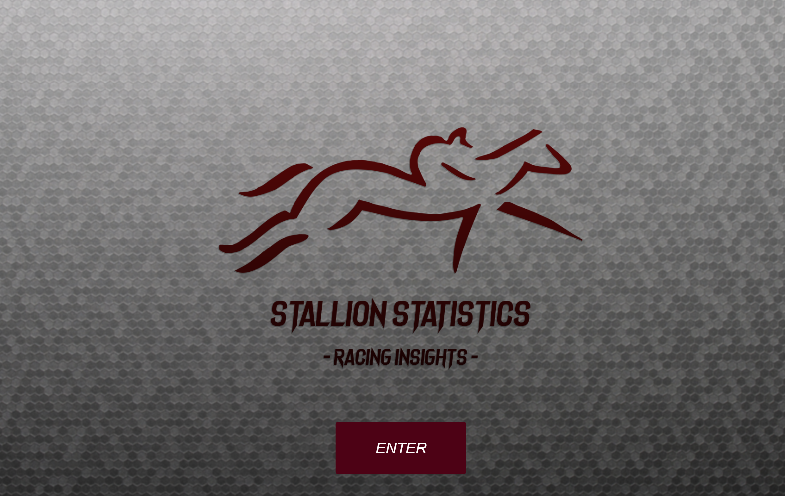
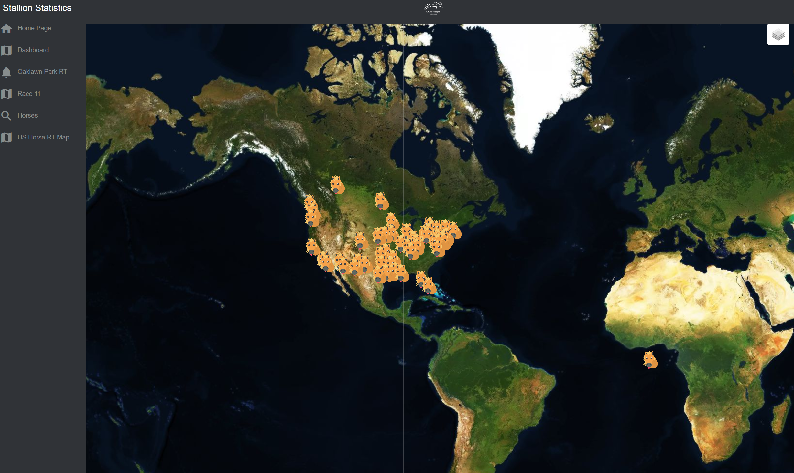
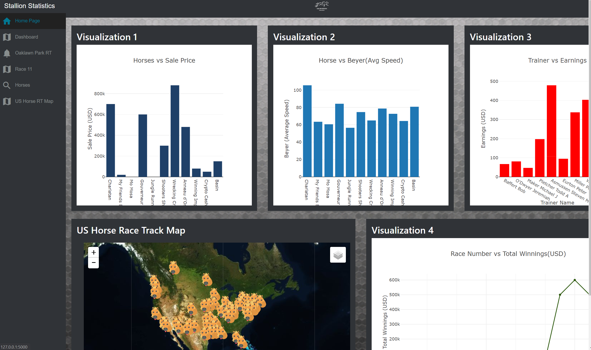
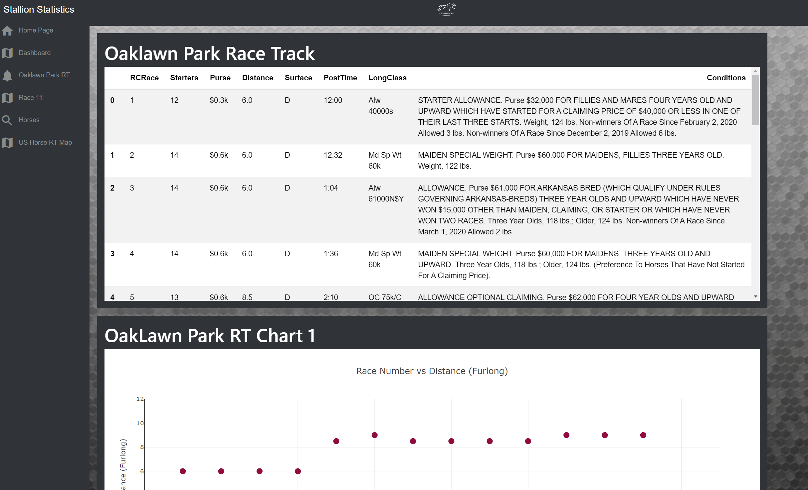
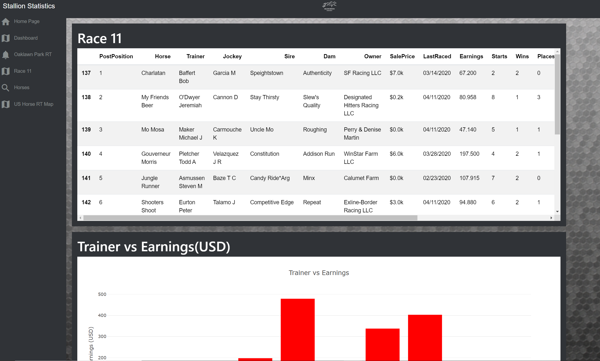
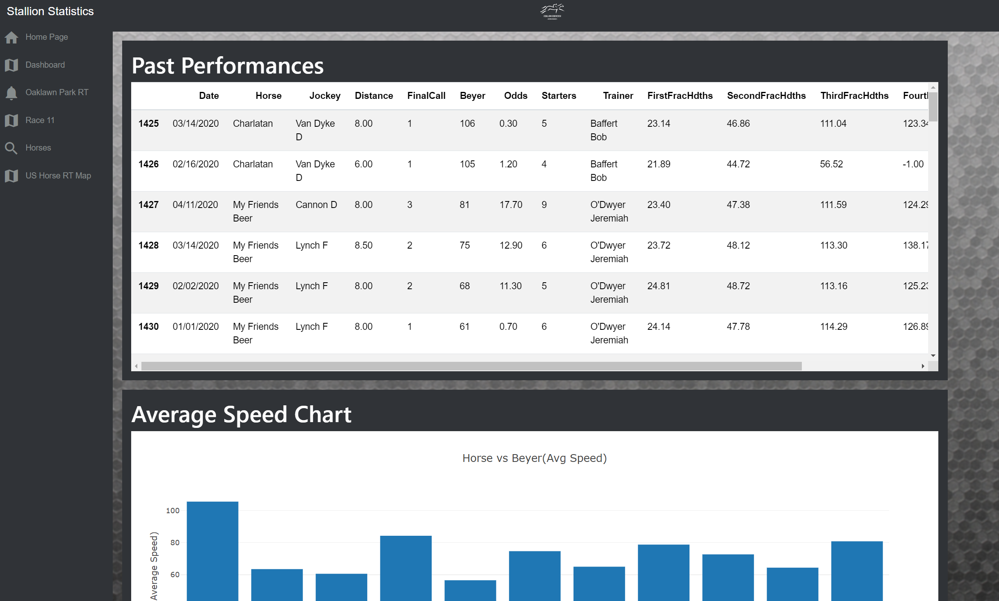

# Project 2: Stallion Statistics

## Objective: Develop a Website with Simplified Views of Horse Racing Data

Horse racing is sport with history that dates back to about 4500 BC, making it the oldest sport in history. Today, horse races are run from across the globe, from Australia and Asia to North and South America. The worldwide racing industry is estimated to generate over 115 billion dollars in revenue yearly, strictly from gambling. Gamblers need data to make informed decisions; one of the biggest hurdles most new bettors experience is the overwhelming amount of data compiled in racing forms for each specific race. 

The premise of our project is to sort through and break down the most valuable data. How do we create a website that helps engages novices’ players with user-friendly insights that easy to navigate?

  1. Access to Racetrack websites and locations using data from Bloodhorse.com  

  2. Create an interactive Map that uses longitude and latitude for track location in North America.

  3. Present important race variables in easy-to-read charts.
  4. Use our understanding of key race variables to help deduce which horse will have the best chances of winning.

What are our sources of Data?

  1. Oaklawn Park May 2, 2020 Racing CSV, Daily Racing Form.

  2. Compile spatial data from Bloodhorse.com How was the data transformed?

  3. CSV file transformed Data with Pandas/Jupyter Notebooks – split into separate DFs based of their information catergory, then exported into multiple CSV files. 2.Uploaded the data to a MongoDB server as an online host.

The Stallion Statistics Team:
   * @hharutyunyan1
   * @aesdub
   * @aldogarcia02
   * @AymanSulaiman

We used the following technologies:
  * Flask Micro Server (Python)
  * Plotly (Javascript)
  * MongoDB Atlas Server
  * HTML/CSS
  * Pandas (Python)
  * Leaflet (JavaScript)
  * D3 (Javascript)
  * Beautiful Soup (Python)
  * Splinter (Python)

